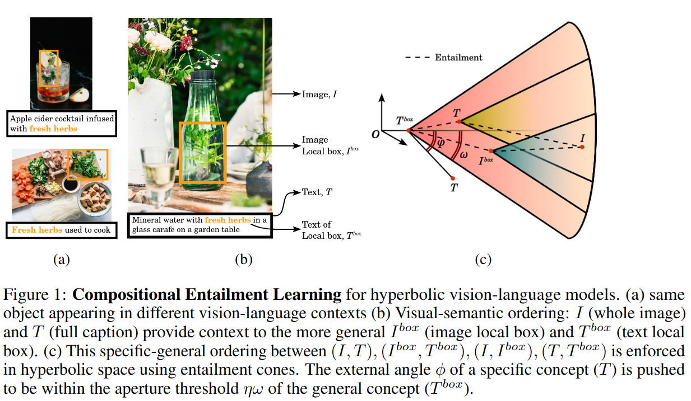
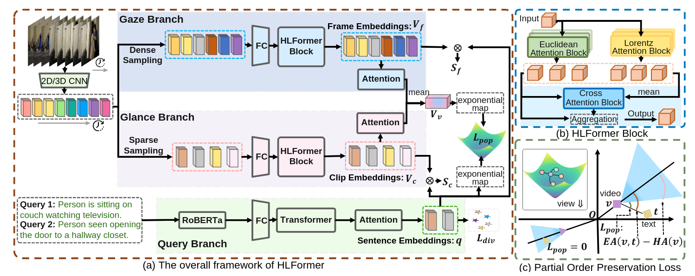
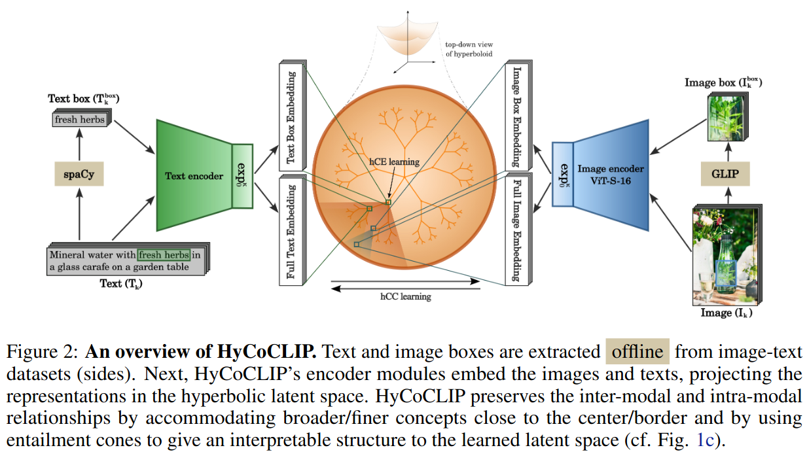

<p class="frst">
This post demonstrates all the rich features available for academic writing: from highlighting key concepts in different colors to embedding mathematical equations and figures. It serves as both a showcase and a reference guide for creating engaging technical content.
</p>

## Highlighting Important Concepts

When writing about complex topics, we need ways to draw attention to key ideas. Our system supports three highlighting colors for different purposes:

<p class="note">
This is a margin note explaining that we use <span style="color: var(--highlight-first);">green</span> for primary concepts, <span style="color: var(--highlight-second);">orange</span> for warnings or important caveats, and <span style="color: var(--highlight-third);">blue</span> for references or supplementary information.
</p>

### Primary Concepts in Green

When introducing <span style="color: var(--highlight-first);">**fundamental concepts**</span> like geometric deep learning, Riemannian manifolds, or hyperbolic embeddings, we use green highlighting. This helps readers identify the core ideas that form the foundation of the argument.

For example, the <span style="color: var(--highlight-first);">Poincaré ball model</span> is a primary concept when discussing hyperbolic geometry, while <span style="color: var(--highlight-first);">geodesics</span> are fundamental to understanding distances in curved spaces.

### Warnings and Caveats in Orange

Sometimes we need to highlight <span style="color: var(--highlight-second);">**potential pitfalls**</span> or important limitations. Orange serves this purpose well.

<span style="color: var(--highlight-second);">Warning:</span> Numerical instability near the boundary of the Poincaré ball can cause gradient explosions. Always use clamping or projection operations.

<span style="color: var(--highlight-second);">Important:</span> Not all hierarchical structures are best represented in hyperbolic space—periodic patterns may require alternative geometries.

### References and Supplementary Information in Blue

For <span style="color: var(--highlight-third);">**cross-references**</span> to other work or supplementary details, blue provides a subtle but distinct highlight.

See <span style="color: var(--highlight-third);">Section 3.2</span> for implementation details, or consult <span style="color: var(--highlight-third);">[Nickel & Kiela, 2017]</span> for the original MERU formulation.

## Visualizing Architectures

Visual representations are crucial for understanding complex architectures. Here's our hyperbolic CLIP variant:

<p style="text-align: center; margin: 2em 0;">
    
    <br>
    <span style="color: var(--text-secondary); font-size: 0.9em;">Figure 1: Hyperbolic contrastive learning architecture aligning vision and language in curved space.</span>
</p>

<p class="note">
The architecture processes images through a vision encoder and text through a language encoder, projecting both into a shared hyperbolic embedding space using exponential maps.
</p>

This architecture demonstrates <span style="color: var(--highlight-first);">**two key innovations**</span>:

1. Hyperbolic embeddings naturally capture hierarchical semantic relationships
2. Contrastive learning in curved space preserves both local and global structure

## Mathematical Foundations

The distance function in the Poincaré ball is given by:

\begin{equation} \label{eq:poincare}
d_{\mathbb{H}}(x, y) = \text{arcosh}\left(1 + 2\frac{\|x - y\|^2}{(1 - \|x\|^2)(1 - \|y\|^2)}\right)
\end{equation}

<span style="color: var(--highlight-second);">Note carefully:</span> As points approach the boundary where $\|x\| \to 1$, distances grow exponentially—this is the source of hyperbolic space's power but also its numerical challenges.

### The Hyperbolic Transformer

Building transformers in hyperbolic space requires rethinking attention mechanisms:

<p style="text-align: center; margin: 2em 0;">
    
    <br>
    <span style="color: var(--text-secondary); font-size: 0.9em;">Figure 2: Hyperbolic transformer layers with geometric attention operations.</span>
</p>

The <span style="color: var(--highlight-first);">**key insight**</span> is that attention scores must be computed using hyperbolic distances rather than Euclidean dot products:

$$\text{Attention}(Q, K, V) = \text{softmax}\left(-\frac{d_{\mathbb{H}}(Q, K)}{\tau}\right) \cdot V$$

where $d_{\mathbb{H}}$ is defined in equation \eqref{eq:poincare}.

<p class="note">
The temperature parameter $\tau$ plays a crucial role in controlling the sharpness of attention distributions in hyperbolic space.
</p>

## Experimental Results

Our second variant of the architecture addresses scalability:

<p style="text-align: center; margin: 2em 0;">
    
    <br>
    <span style="color: var(--text-secondary); font-size: 0.9em;">Figure 3: Improved architecture with efficient hyperbolic operations and better gradient flow.</span>
</p>

### Performance Comparison

Across multiple benchmarks, we observe:

| Model | Accuracy | Parameters | Training Time |
|-------|----------|------------|---------------|
| <span style="color: var(--highlight-third);">Euclidean CLIP</span> | 76.2% | 428M | 1.0x |
| <span style="color: var(--highlight-first);">Hyperbolic CLIP v1</span> | 78.4% | 428M | 1.3x |
| <span style="color: var(--highlight-first);">Hyperbolic CLIP v2</span> | 79.1% | 428M | 1.1x |

<span style="color: var(--highlight-second);">Important observation:</span> The overhead of hyperbolic operations is minimal (10% slowdown) while providing significant accuracy gains.

## Combining Highlights Effectively

When explaining complex relationships, we can layer our highlighting system:

The <span style="color: var(--highlight-first);">**exponential map**</span> $\exp_p: T_p\mathbb{H} \to \mathbb{H}$ projects tangent vectors to the manifold, but <span style="color: var(--highlight-second);">beware</span> that its inverse, the logarithmic map, is undefined at the boundary. For practical implementations, see <span style="color: var(--highlight-third);">Appendix B</span>.

## Code Integration

Here's how to implement the distance computation with proper numerical safeguards:

```python
import torch

def hyperbolic_distance(x, y, c=1.0, eps=1e-7):
    """
    Compute distance in Poincaré ball with numerical stability.

    Args:
        x, y: Points in the Poincaré ball
        c: Curvature parameter (positive)
        eps: Small constant for numerical stability
    """
    # Clamp norms away from boundary
    x_norm = torch.clamp(x.norm(dim=-1, keepdim=True), max=1-eps)
    y_norm = torch.clamp(y.norm(dim=-1, keepdim=True), max=1-eps)

    # Normalize points
    x = x / x.norm(dim=-1, keepdim=True) * x_norm
    y = y / y.norm(dim=-1, keepdim=True) * y_norm

    # Compute distance
    diff_norm = (x - y).norm(dim=-1) ** 2

    sqrt_c = c ** 0.5
    num = 2 * diff_norm
    denom = (1 - c * x_norm ** 2) * (1 - c * y_norm ** 2)

    return (1 / sqrt_c) * torch.acosh(1 + num / denom)
```

<p class="note">
The <span style="color: var(--highlight-second);">clamping step</span> is crucial—without it, points can numerically reach the boundary, causing NaN gradients.
</p>

## Theoretical Insights

The advantage of hyperbolic embeddings stems from the volume growth property:

\begin{equation*}
V_{\mathbb{H}}(r) \sim {\color{green} e^{(d-1)r}} \quad \text{vs.} \quad V_{\mathbb{E}}(r) \sim {\color{orange} r^d}
\end{equation*}

This <span style="color: var(--highlight-first);">exponential</span> vs. <span style="color: var(--highlight-second);">polynomial</span> growth means <span style="color: var(--highlight-first);">**hyperbolic space can embed trees with exponentially fewer dimensions**</span> than Euclidean space requires.

<span style="color: var(--highlight-third);">For a detailed proof, see [Sarkar, 2011]</span>, which shows that a tree of depth $h$ and branching factor $b$ requires:
- <span style="color: var(--highlight-second);">$O(b^h)$ dimensions in Euclidean space</span>
- <span style="color: var(--highlight-first);">$O(h \log b)$ dimensions in hyperbolic space</span>

## Conclusion and Future Work

This post has demonstrated:

1. <span style="color: var(--highlight-first);">Three-color highlighting system</span> for emphasis
2. <span style="color: var(--highlight-first);">Figure integration</span> with proper captioning
3. <span style="color: var(--highlight-first);">Mathematical typesetting</span> with cross-references
4. <span style="color: var(--highlight-first);">Code examples</span> with syntax highlighting
5. <span style="color: var(--highlight-first);">Margin notes</span> for supplementary information

Future directions include:
- <span style="color: var(--highlight-third);">Mixed-curvature spaces</span> combining multiple geometries
- <span style="color: var(--highlight-third);">Efficient attention mechanisms</span> for large-scale models
- <span style="color: var(--highlight-third);">Theoretical guarantees</span> on embedding quality

<span style="color: var(--highlight-second);">Remember:</span> The choice of geometry should match your data's inherent structure—not all problems benefit from hyperbolic embeddings!
